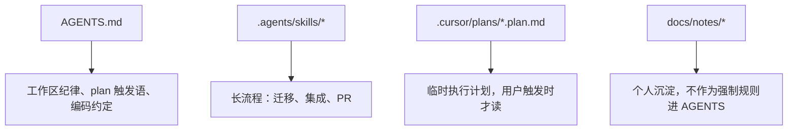

# AI 编码工具工程化使用

> 个人工程复盘（细节已脱敏）。  
> 目标：把 AI 编码代理当成可复用工程能力——`AGENTS.md` / skills / plan 如何分层，命令行如何减少踩坑。  
> 仓库规则仍写各项目 `AGENTS.md`，本文件不替代。

---

## 1. 一句话结论

`AGENTS.md` 是编码代理启动时并入的**持久指令链**（稳定规则、安全边界、工作流触发），不是知识库、不是聊天记录。  
沙箱、模型、review 与计划执行等实操坑，可按下文原则处理。

---

## 2. 工具与上下文不要混用

| 位置 | 是什么 | 对话/上下文 |
|------|--------|-------------|
| **编辑器聊天面板** | IDE 内置 Agent | 只在当前会话中 |
| **终端编码代理** | 命令行 Agent | 仅本终端会话 |
| **编辑器代理扩展** | IDE 扩展 Agent | 另一条会话 |

- 编辑器上下文桥接成功，**不会**自动带上另一条聊天记录。
- 要让代理知道此前讨论：显式附加文件、计划或精简交接稿。

**与编辑器规则的差异：** 两者都是持久规则；编码代理还可能叠加 sandbox、approval、skills、IDE context。`AGENTS.md` 告诉 agent **怎么工作**，不替代读文件、不替代 PRD。

---

## 3. 配置与 AGENTS 层级

| 文件 | 作用 |
|------|------|
| 用户级代理配置 | 全局：模型、沙箱等 |
| 项目级代理配置 | 项目覆盖（需 trusted） |
| 用户级 `AGENTS.md` | 个人长期代理指令 |
| 仓库 `AGENTS.md` | 工作区/项目规则；**越靠近 cwd 优先级越高** |
| 同目录 `AGENTS.override.md` | 临时覆盖 |

改配置后：重启对应代理会话，否则可能仍使用旧沙箱。

**推荐分层：**



---

## 4. AGENTS.md 写什么、写多大

**适合：** repo 边界、禁 secrets / destructive git / `git add .`、验证习惯、plan 触发语、长期团队约定。  
**不适合：** 一次性任务、长 PRD、聊天记录、真实 token/私有 URL、应进 skill 的长流程。

官方合并有约 **32 KiB**（`project_doc_max_bytes`）上限，超出可能截断。实践：根 `AGENTS.md` 约 **80–160 行**、整体 **< 8–12 KiB**；接近 20 KiB 就拆到 skill。

**何时用 Skills：** 规则变成长流程就拆 skill；`AGENTS.md` 只写「何时用哪个 skill」。

**更新前自问：** 是否长期、是否误伤其它子仓、是否已有 skill、是否含 secret、是否逼近 32 KiB。  
**更新后：** UTF-8 读回、与现有 skills 不冲突、规则可一句话触发。

---

## 5. IDE Context

保守模型即可：

- 打开 tab → 常有**路径**，不保证全文；焦点文件/选区权重更高。
- **不会**自动注入：全工作区、其他聊天、未打开文件全文。
- 要基于内容判断 → 代理应**主动读文件**；重要文件显式附加；必要时手动同步编辑器状态。
- plan 常在 `.cursor/plans/`，不在仓库根 → 给**完整相对路径**，或只打开一个 `.plan.md`。

---

## 6. Plan 驱动的代理执行

**推荐分工：** 先做方案/plan；再由一个编码代理按 plan 改代码、跑命令、review；**一条执行线**，避免两边各改一半。

**换对话（轻装继承）**：旧会话末尾让 Agent 按交接模板写出简短 handoff；新会话只附加该文件与 plan，不要复制整段历史。

**流程：**

1. 生成 plan，**只打开一个** `.plan.md`（或消息里写清路径）。
2. 在**目标仓库**目录启动编码代理（多仓库根 ≠ git 根）。
3. 触发语（推荐）：

```text
执行当前打开的计划：<相对路径>.plan.md
```

4. 代理应：读 plan → 总结阶段与写入/只读仓库 → 各仓 `git status --short` → 按阶段执行、不扩 scope → 阶段后验证 → **不 commit**（除非明确要求）→ 保留无关 dirty。

**别用太泛的词：** `继续` / `开始` / `开干`（易和普通聊天混淆）。

---

## 7. Windows 沙箱（高频坑）

**现象：** `windows sandbox: spawn setup refresh`；日志常见 **os error 740**（需要提升）→ 命令未执行就失败。

**日志：** 查看编码代理生成的日期化沙箱日志，确认失败发生在实际命令执行前还是执行中。

**修复：** 在用户级代理配置中调整 Windows 沙箱模式：

```toml
[windows]
sandbox = "unelevated"
```

临时覆盖配置后重启代理。确认命令实际执行，且日志不再出现权限提升失败。

---

## 8. 编码（中文 / PowerShell）

- 编码代理读文件通常默认 UTF-8；乱码多在 PowerShell 裸 `Get-Content` → 用 **`-Encoding UTF8`**。
- `config.toml`：`features.powershell_utf8 = true`；终端 `chcp 65001`，优先 **pwsh**。
- 可在 `AGENTS.md` 写死：读中文禁止裸 `Get-Content`。

---

## 9. 模型与 `/review`

| 场景 | 建议 |
|------|------|
| plan 实现、删码、跨文件重构 | **gpt-5.5 + high**（默认） |
| 单点卡死（schema/边界） | 临时 **xhigh**，做完改回 high |
| 全程 xhigh | 不推荐 |
| 简单脚本 | gpt-5.4-mini（复杂易返工） |

`/review`：审**未提交** diff，输出 P1/P2；大删码/ORM/config/鉴权**建议跑**；不能替代 pytest。节奏：`实现 → 自测 →（大改）/review → 修 P1 → commit`。查看设置：**`/status`**。

---

## 10. 终端速查

**`Working` 时：** **Esc** 打断；**`/status`** 一般可用；**`/review`**、**`/ide`** 常排队；**`/plan`** 任务中往往不可用。

| 命令 | 用途 |
|------|------|
| `/status` | 模型、沙箱、token |
| `/model` | 换模型 / effort |
| `/mention` | 附加文件 |
| `/review` | 审未提交改动 |
| `/ide` | 拉编辑器状态 |
| `/diff` | git diff |
| `/compact` | 压缩对话 |
| `/quit` | 退出 |

---

## 11. Git 与误操作恢复

- 提交在**目标子仓库**；**`git add <路径>`**，禁止 `git add .`。
- 代理改错未 commit → `git restore`；只删代理**新增**文件，**别删**你原有的未跟踪稿。
- 稿被覆盖 → 使用编辑器时间线或本地历史恢复。
- 误跑错 plan → 只撤回代理产生的 diff；未 commit 的 PRD **不要用删文件当撤销**。

---

## 12. 新环境 Checklist

```text
[ ] 确认编码代理版本、编辑器扩展与登录状态
[ ] 配置用户级沙箱策略
[ ] 准备已脱敏的工程使用说明
[ ] 各项目 AGENTS.md / skills 按需
[ ] pwsh + UTF-8；目标仓 cwd 启动 codex；IDE context on
[ ] 跑 Get-Content / rg，确认无 spawn setup refresh
[ ] 大改：明确 plan 路径；/review + 测试后再 commit
```

---

## 13. 维护

- 新坑：在本文件加小节并注明日期。
- 换机：备份本文件与用户级代理配置。

*最后更新：2026-06-03*
