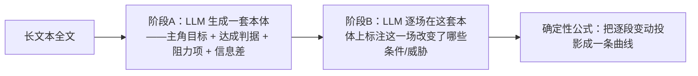
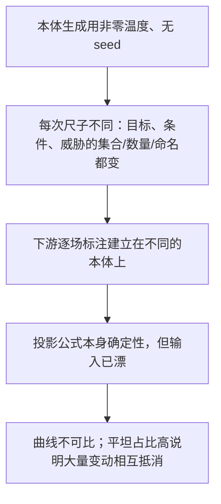

# 11 · AI 迭代反模式：指标幻觉与方向失控复盘

> 来自实习中的真实故障与对照实验（细节已脱敏）。  
> 目标：把一次“指标全绿、结果失真”的优化失败抽象成可复用的工程纪律。标本是叙事结构曲线与多阶段抽取，结论适用于任何多阶段 LLM 抽取/生成系统。

---

## 1. 核心结论

在 AI 抽取/生成系统里，三条纪律的缺失会让迭代在错误方向上复利式偏离：

1. **指标绿 ≠ 质量好**。当测试测的是"实现契约"而不是"产品行为"，绿灯只会掩盖回归，而不是证明质量。
2. **降随机性的前提是先固定"测量的尺子"**。当系统赖以判断的本体（目标 / 判据 / 实体清单）每次重造，多次调用与投票只会在噪声上叠噪声，不会收敛。
3. **没有人工根因，就没有资格推进**。同一输入多次跑的方差是最便宜、最能证伪的实验；跳过它、只信 AI 自造指标，等于闭眼加速。

一句话：**先证明可复现，再谈优化；先固定尺子，再谈精度；小步、可归因、能证伪才推进。**

---

## 2. 第一性原理

- **可复现性是测量系统的前置条件**。尺子每次变，读数之间不可比，任何"提升"都无法归因。
- **多阶段管线里误差相乘不相加**。上游本体漂一点，下游全部建立在不同基准上，误差被放大而非平均。
- **LLM 的一致性高度依赖任务形态**。分类题、核对题、引用题一致性高；开放式生成（发明本体、自由措辞）方差大。投票只在"固定身份的离散空间"里收敛，对开放生成无效。
- **`temperature=0` 不等于确定性**。温度只压采样分布，不消除 MoE 路由 / 批处理 / 浮点带来的不可复现；无 `seed` 时连采样都不固定。

---

## 3. 问题背景与标本

### 3.1 业务背景

系统要为一段叙事文本生成一条**叙事结构曲线**：横轴是文本进度，纵轴是核心角色的“叙事状态”（离目标多近），曲线的起伏用来标记阶段变化。它的生成是一条多阶段 LLM 管线：

设计意图是好的：让 LLM 只做"抽事实"，把打分留给公式。问题出在阶段 A——这套"本体"就是后续一切计算的尺子，而它每次都由 LLM 现场重新发明。

### 3.2 现象

同一份长文本重复解析，产出的曲线**每次都明显不同**；图能画出来，但状态转移不可信，无法稳定表达结构。

### 3.3 结构化事实（同一部剧多次运行的对比）

| 层 | 运行间差异 |
|---|---|
| 生成的主角目标措辞 | 每次不同 |
| 条件分组数 | 在 4~5 之间抖动 |
| 威胁（阻力项）数 | 5~6 之间抖动 |
| 钩子这类实体的通道 | 有的运行完全缺失 |
| 被标为“有变动”的文本单元数 | 逐次不同 |
| 曲线"平坦占比" | 高达 75%~84%（大量变动相互抵消，曲线大段是平的） |
| 最黑暗时刻的位置 | 逐次漂移 |

关键观察是：最上游、影响最大的**本体生成**步骤使用非零温度且没有固定 `seed`；下游逐单元标注虽采用低随机性设置，也没有统一复现策略。于是最关键的测量尺子没有被锚定。

### 3.4 根因链（推断，由上述事实支撑）

单点故障是**本体生成 / 条件分解**这一步：它是整个方案的测量基础，但实现层没有对它做锚定或冻结。

### 3.4 为什么"多次调用/投票"没救回来，反而更糟

- **投票需要稳定身份**。多次运行里同一个实体可能换名、被拆分或消失，跨运行没有稳定 ID。要投票就得先做语义对齐，而对齐本身又是一次不稳定的 LLM 任务——在噪声上叠噪声。
- **补丁打在错误的层**。多投票、按窗口切分本体、事后修补曲线形状，都是在下游掩盖上游不稳定，还翻了数倍成本，最终被整体回滚回稳定基线。

---

## 4. 反模式清单（可复用的"不要做"）

| 反模式 | 表现 | 后果 |
|---|---|---|
| 指标幻觉 | 用实现细节断言 / mock 当质量门；把"与参考答案重合度"命名为 precision | 绿灯掩盖产品回归 |
| 尺子漂移 | 每次都重造本体，却期望跨次结果稳定 | 读数不可比，优化无法归因 |
| 层错投票 | 在开放生成层做投票 + LLM 语义对齐 | 噪声叠噪声，成本翻倍 |
| 事后救援 | post-hoc 修补输出形状 | 掩盖上游不稳定，复现性更差 |
| 无信度门 | 无论多不稳都自信输出精确产物 | 用户看到"精确的错误" |
| 无人工根因 | AI 报绿即推进，不做同输入多次跑的方差实测 | 在错误方向上加速 |
| 步子过大 | 一次改多层、上多个机制 | 无法定位是哪个改动导致回归 |

---

## 5. 工程纪律（可复用的"要做"）

1. **先测信度，再谈优化**：同一输入跑 N 次，计算关键产物的一致性（曲线秩相关 / 关键结构点位置 / 高光集合重合度）作为推进的决策门。信度不达标就先修信度，不做别的。
2. **固定尺子**：本体（目标 / 判据 / 实体清单）抽一次、审核、冻结、复用；优先用稳定的上游产物或模板词表做种子约束，把 LLM 从"发明本体"降级为"填槽 + 给证据"。
3. **分离确定性与生成**：能用公式/规则确定的就不交给模型；必须生成的部分隔离出来，降温 + 固定 seed + 轻量人工审核。
4. **投票只放在固定身份的分类层**：给定冻结本体后问"实体 X 在单元 S 是否变动"，这才是投票能收敛的形态。
5. **指标测产品行为，不测实现契约**：优先行为测试、golden 样本、真实 badcase；避免把 mock 一致性当质量。
6. **小步可归因**：一次只改一层，改完用同一批固定样本量方差，能证伪再推进；不能证伪的机制不上线。

---

## 6. 可复述版本

> 有一次叙事结构曲线出现“同一份输入每次跑结果都不一样”。查多次运行的数据后定位到：随机性来自最上游的本体生成——它在每次运行中重新生成目标和判据清单，下游标注再准也建立在不同尺子上，误差被逐层放大。  
> 之前的补救（多次调用投票、按窗口切分、事后修补形状）失败，是因为投票要先把两套不同本体语义对齐，而对齐本身又是不稳定的 LLM 任务，等于在噪声上叠噪声，还翻了成本。  
> 真正的解法不是加模型调用，而是先固定尺子：本体抽一次、冻结、复用；把确定性计算和开放式生成分开；投票只放在固定身份的分类层；并加一道信度门，同输入多次跑不稳就降级声明，而不是自信输出一份精确的错误。

---

## 7. 我犯的错（诚实复盘）

- **步子迈太大**：一次性改多层、上多个机制，回头无法判断是哪个改动导致回归。
- **错信 AI 自造的绿指标**：把测试通过当成质量达标，没意识到测的是实现契约不是产品行为。
- **缺人工根因**：一直在"改 prompt / 加机制"，却没做"同一输入多次跑量方差"这个最便宜的证伪实验，导致在错误方向上越走越远。

教训：AI 能加速执行，但**方向对不对、根因找没找到，只能靠人来判断**；把判断权让渡给指标，就是把方向盘交给噪声。

---

*最后更新：2026-07-14*
