# 10 · 生产级 SaaS 基础设施架构蓝图

> 公开版工程蓝图。本文将可复用的基础设施经验抽象为 SaaS 架构方案，只保留架构原则、组件边界、设计取舍和落地清单。

---

## 1. 核心结论

一个可以真实运营的 SaaS 项目，核心不是“前端页面 + 若干接口”，而是以下能力是否形成闭环：

- 身份：用户如何登录、鉴权、隔离数据、调用内部服务；
- 入口：公网流量如何进入系统，网关如何路由和保护后端；
- 编排：前端如何通过 BFF 安全访问数据库、微服务和第三方能力；
- 数据：业务数据、缓存、文件、任务状态分别放在哪里；
- 成本：模型、视频、工具、存储等成本如何归属到用户或账户；
- 异步：长任务如何排队、执行、重试、恢复和展示进度；
- 部署：本地、测试、生产环境如何保持同构但不混用配置；
- 运维：健康检查、日志、指标、追踪、告警、回滚、密钥轮换如何落地。

可复用的不是某个项目的源码，而是这些层之间的职责边界。

---

## 2. 目标架构总览

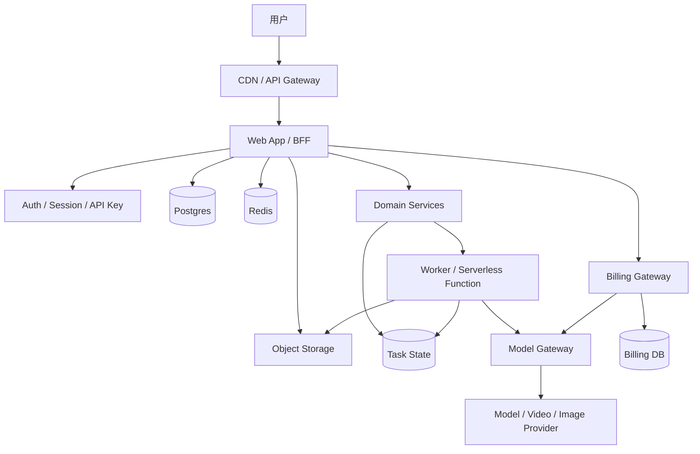

| 层 | 职责 | 典型组件 |
|---|---|---|
| 入口层 | 公网访问、HTTPS、CORS、路由、限流、WAF | CDN、API Gateway、Load Balancer |
| Web / BFF | 页面、用户态 API、服务端编排、密钥收口 | Next.js、Remix、FastAPI、tRPC、REST |
| 身份层 | 登录、会话、API key、SSO、服务间身份 | Better Auth、Auth.js、Clerk、OIDC |
| 数据层 | 用户、业务对象、任务状态、消费流水 | Postgres、Drizzle、Prisma、SQLAlchemy |
| 缓存层 | session 缓存、限流、短期状态、队列辅助 | Redis、Upstash |
| 文件层 | 图片、视频、上传文件、报告产物 | S3、R2、OSS、TOS、MinIO、RustFS |
| 计费层 | 额度、预扣款、消费流水、余额查询 | Billing Gateway、Billing Core |
| 模型网关 | 多模型路由、provider 适配、cost 来源 | LiteLLM、OpenAI-compatible gateway |
| 异步层 | 长任务、工作流、重试、恢复 | Queue、QStash、Worker、FaaS |
| 运维层 | 健康检查、日志、指标、追踪、告警 | OTEL、Sentry、Grafana、Langfuse |

### 2.1 用户请求主链路

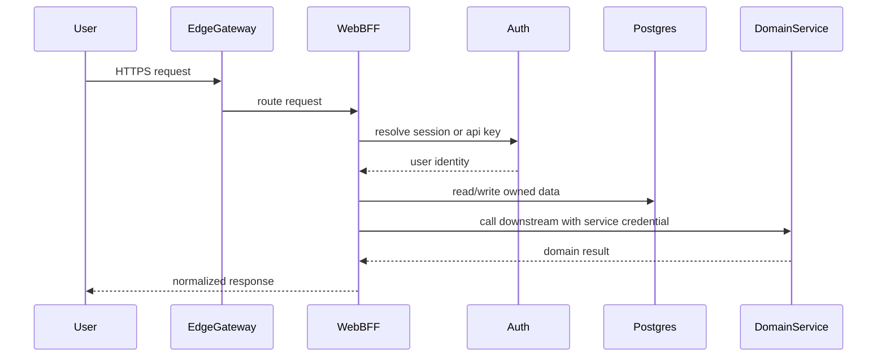

这条链路的重点是：浏览器只信任 BFF，BFF 再代表用户访问数据库和内部服务。用户身份、服务凭证、下游错误、计费上下文都在 BFF 收口。

### 2.2 长任务主链路

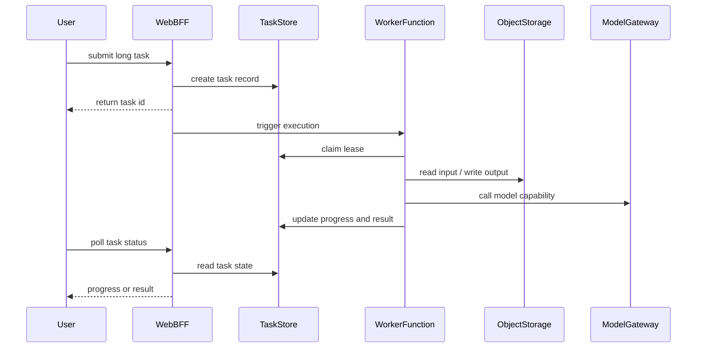

这条链路的重点是：任务状态是持久化对象，不依赖某个 Web 进程是否还活着。前端拿 `task_id` 查询进度，worker 可以失败、重试、恢复。

### 2.3 安全边界图

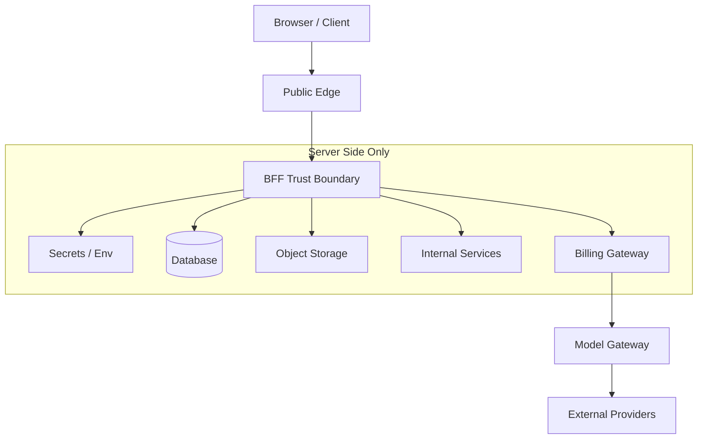

安全边界的核心规则：

- 浏览器可以持有用户 session，但不能持有服务密钥；
- BFF 可以读取服务端配置，但不能把服务端密钥下发给浏览器；
- 内部服务只信任 BFF 注入的用户身份；
- 成本请求必须经过计费边界；
- 外部 provider 的错误和响应必须脱敏后返回。

---

## 3. 基础设施设计原则

### 3.1 前端不直连核心服务

浏览器不应直接访问数据库、模型供应商、内部微服务、对象存储密钥或计费系统。所有敏感调用应经过 BFF。

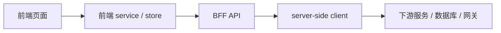

BFF 负责解析身份、校验权限、注入服务端密钥、转换协议、控制超时、统一错误格式、记录审计日志，并注入计费上下文。

### 3.2 身份权威源只能有一个

主站应是用户身份权威源。下游服务不应各自维护独立账号体系，否则会出现用户映射混乱、权限割裂、多用户串数据、计费归属错误。

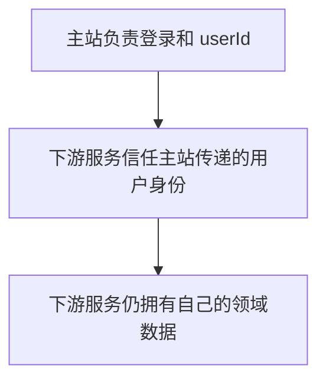

服务间身份常见三种模式：

| 模式 | 做法 | 适用场景 |
|---|---|---|
| Service Token | BFF 用固定服务凭证调用下游 | 内部服务、管理接口 |
| Service Token + User Header | 服务凭证证明调用方可信，用户头表达终端用户 | 内部领域微服务 |
| Per-user Key / Account | 每次请求携带用户密钥或账户上下文 | 模型计费、第三方 API 归属 |

安全约束：用户头只能由 BFF 注入；浏览器传来的用户头必须丢弃；service token 只能存在服务端；高安全场景可升级为短期 JWT、mTLS 或私有网络访问。

### 3.3 数据归属要清楚

微服务拆分后，最重要的原则是数据自治：

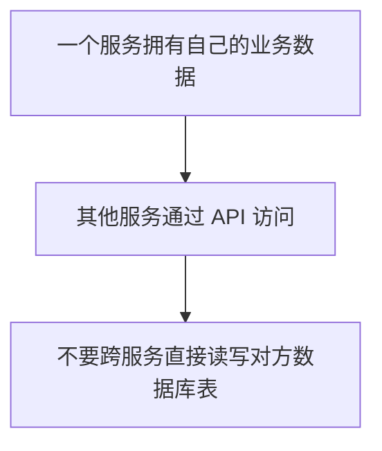

早期中小 SaaS 通常不需要分库分表。推荐先使用单 Postgres、多业务表、所有用户数据带 `user_id` 或 `owner_id`，并在数据访问层统一注入用户身份。

### 3.3.1 跨服务存储不是一套

微服务架构里，“主站使用哪套数据库”和“下游服务使用哪套数据库”是两个问题。BFF 可以使用主站自己的 Postgres / Redis，下游领域服务仍然可以拥有自己的 Postgres / Redis。

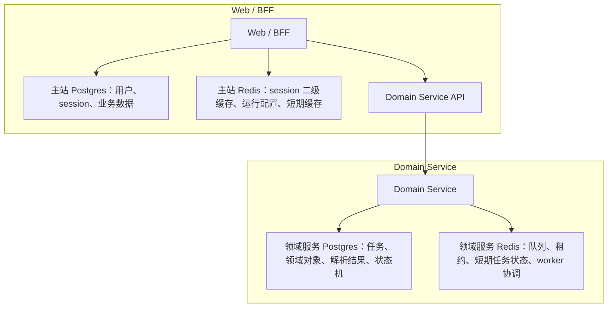

边界判断：

- 如果数据属于主站用户体系、登录态、用户配置、主站资源列表，归主站存储；
- 如果数据属于下游领域服务的任务执行、领域状态、领域产物索引，归下游服务存储；
- BFF 通过 API 访问下游服务，不跨服务直连对方数据库；
- 下游服务信任 BFF 注入的用户身份，但不共享 BFF 的 session 存储；
- Redis 也要按服务边界区分，不能因为都是缓存就混成一个。

实践要点：主站 BFF 与独立领域服务可以分别拥有数据与缓存依赖；关键是通过稳定 API 交互，并让每项数据归属清晰可验证。

### 3.4 文件不依赖本地磁盘

本地磁盘会把服务绑定到单机，阻碍多副本、serverless、迁移和容灾。

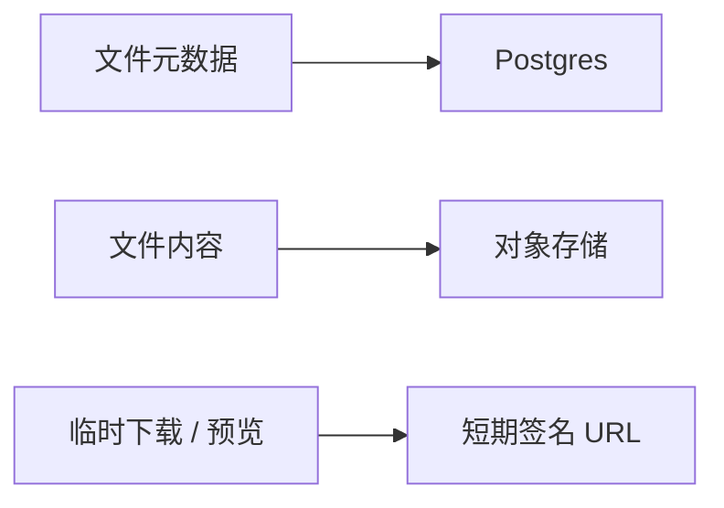

对象存储应承载上传文件、图片、视频、任务输入、任务输出、报告快照和可重放的中间产物。

### 3.5 长任务必须脱离 HTTP 请求

耗时几十秒到几分钟的任务，不应由 Web 请求同步等待。

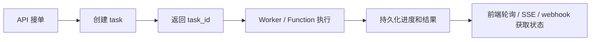

任务状态必须落库，不能把进度放在进程内存里。

### 3.6 成本入口必须统一

AI SaaS 的模型调用、图片生成、视频生成、外部工具都可能产生真实成本。计费不统一会导致双账本、余额误判、成本无法归因。

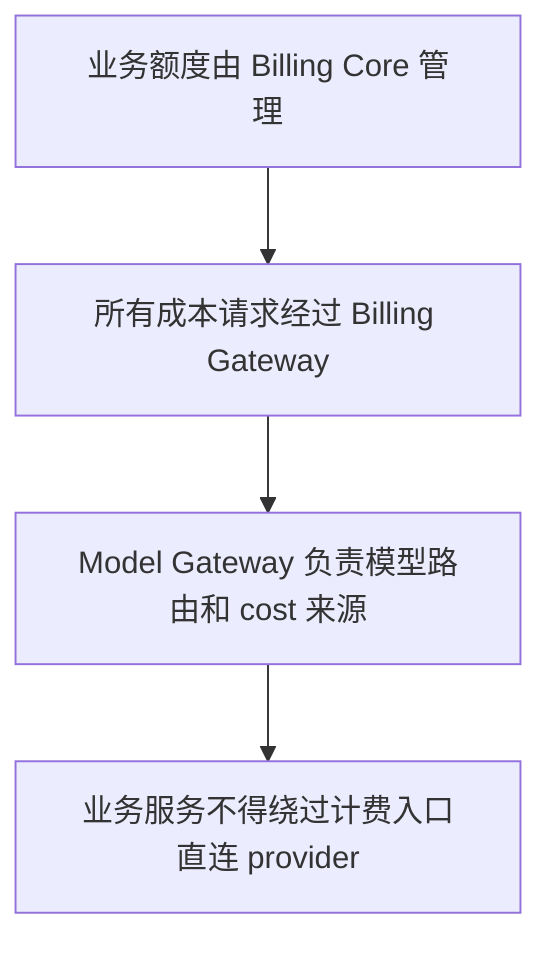

---

## 4. Web / BFF 方案

BFF 至少需要提供用户态 API、鉴权中间件、数据访问层、下游服务 client、错误映射、请求日志、healthcheck、env 校验、文件上传签名和计费上下文注入。

推荐 API 分层：

| API 类型 | 用途 | 保护方式 |
|---|---|---|
| 页面 API | 前端读写业务数据 | 用户 session / API key |
| 内部 API | 服务间调用、worker 回调、后台任务 | service token / internal JWT |
| 代理 API | BFF 代理外部微服务或 provider | 用户身份 + 服务端密钥 |
| 管理 API | health、metrics、repair、admin 操作 | 强 token、IP 限制、审计 |

BFF 不应把下游错误原样抛给前端。统一错误语义应包括未登录、无权限、资源不存在、状态冲突、限流、额度不足、下游超时、下游不可用和内部错误。

错误响应可以包含用户可读 message、稳定 error code、request id、是否可重试和建议操作。不能包含内部域名、原始 SQL、完整 provider response、token、私有 URL、密钥或用户隐私文本。

---

## 5. 身份、权限与数据隔离

早期项目可从邮箱密码、magic link、GitHub / Google、企业 OIDC、API key 中选择少量登录方式。不要一次性接入所有登录方式，先保证一种主登录方式稳定。

推荐：浏览器用户使用 session cookie；程序化访问使用 API key；服务间短调用使用短期 JWT；长期服务凭证放 secret manager；JWT payload 不放敏感信息。

权限模型演进：

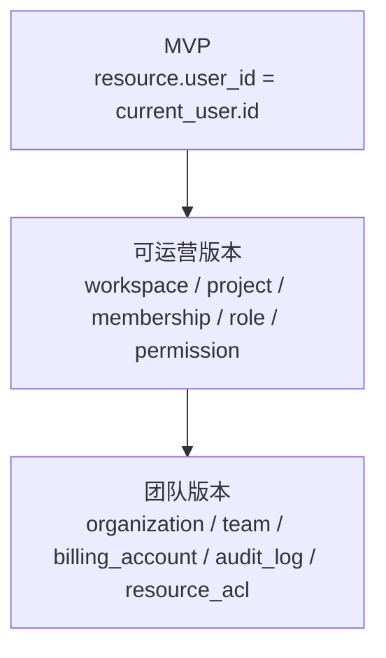

不要过早做复杂 RBAC。先让所有查询都正确带 owner，再扩组织和角色。

---

## 6. 数据库与存储方案

### 6.1 Postgres

默认主库使用 Postgres，适合存用户、session、业务对象、文件 metadata、任务状态、计费账户、消费流水、审计日志和配置快照。

需要注意：所有 schema 变更走 migration；migration 与应用部署解耦；高并发前配置连接池；高频查询加索引；用户数据查询必须带 owner 条件；定期备份，定期恢复演练。

### 6.2 Redis

Redis 适合 session 二级缓存、短期缓存、rate limit、幂等锁、分布式计数器、队列辅助和签名 URL 缓存。

Redis 不适合成为唯一业务真相源。任务最终状态、消费流水、用户数据应落 Postgres。

### 6.3 对象存储

对象存储适合上传文件、图片、视频、任务输入、任务输出、长文本产物和报告归档。

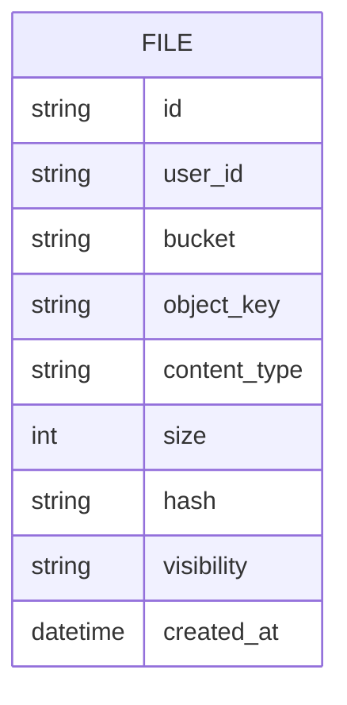

设计注意：文件 key 不要暴露业务敏感信息；上传后用 hash 去重；预览 URL 设置过期时间；删除业务记录时明确是否删除对象；大文件上传使用直传或分片。

---

## 7. 计费与模型网关方案

计费系统管理用户余额、团队额度、后付费额度、预扣款、实际结算、消费流水、管理员调整、对账和冲正。

模型网关管理 provider 路由、模型名称映射、请求转发、重试、cost 原始来源和 provider 错误归一。

两者不能混成一个账本。模型网关可以作为 cost 来源，但业务额度应由计费系统决定。

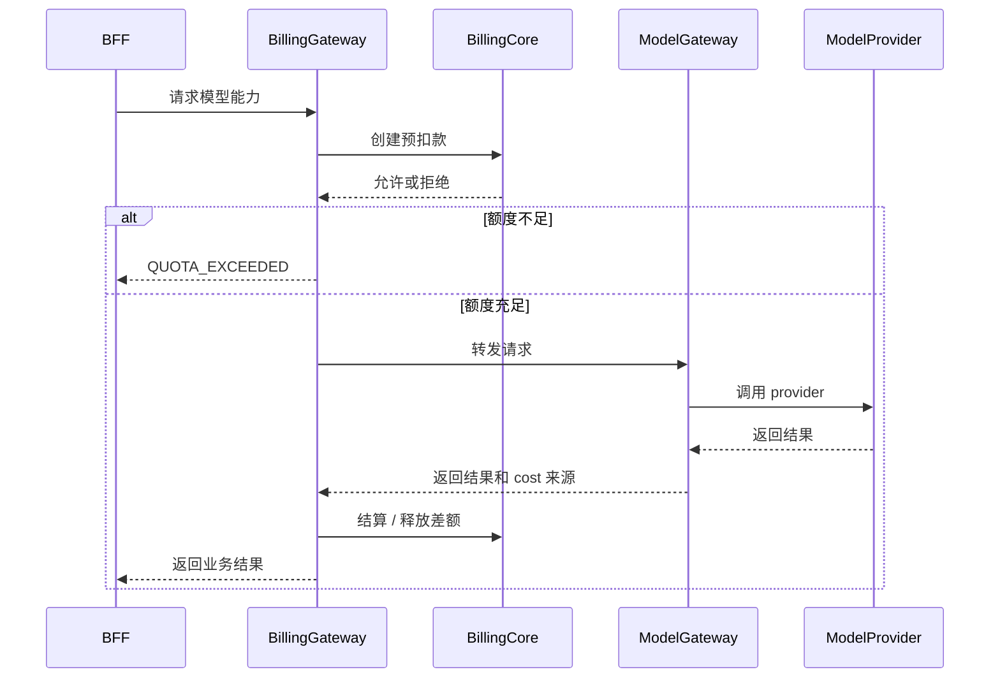

推荐账务模型：

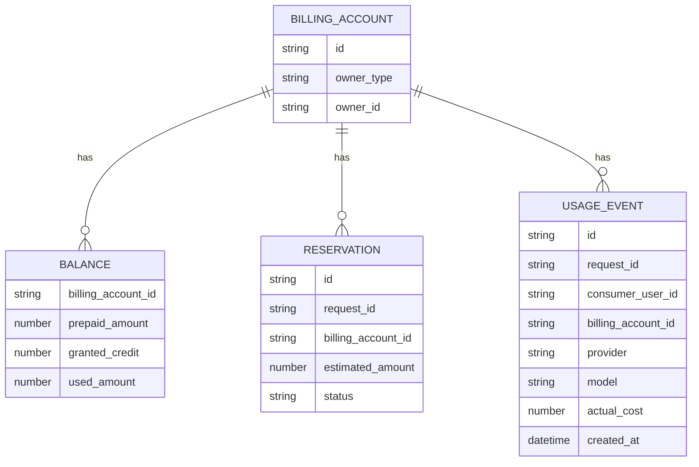

双账本风险：

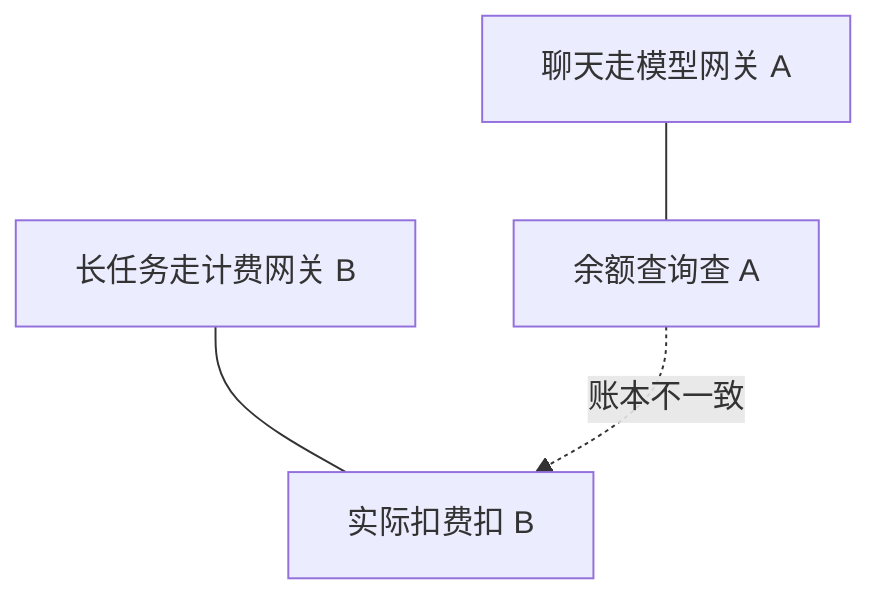

治理方式：dev / staging / production 明确网关矩阵；healthcheck 暴露当前 billing mode；余额查询和实际消费使用同一账本；预算不足错误带来源；禁止生产服务绕过 Billing Gateway。

### 7.1 网关不止一个 face

一个常见误区是把"网关"理解成单一端点。实际上同一个网关底座可以对外暴露**多个 face**，分别服务不同消费方：

| face | 消费方 | 典型协议 | 鉴权 |
|---|---|---|---|
| 补全 / 推理 face | 业务服务、BFF | OpenAI 兼容 HTTP | 服务端 key 或用户头 |
| 工具 / Agent face | 对话型 Agent | 工具协议（如 MCP over HTTP） | 每用户 key / 账户上下文 |
| 管理 / 计量 face | 运维、计费 | 管理 API | 强 token、IP 限制 |

设计要点：

- 同一底座、不同 face 往往是**不同端点、不同协议、不同鉴权头**，不要假设它们共用一套配置；环境矩阵要逐 face 写清楚。
- **工具 face** 让 Agent 把后端数据 / 能力当成可调用工具，是"模型能调到内部数据"的标准做法，但它把权限边界推到了网关：Agent 能看到、能调的工具集合应由**调用者的 key / 账户权限**决定，而不是在 prompt 里硬编码。
- 当工具 face 用**每用户 key**鉴权时，key 同时承担身份、权限、计费三件事——换 key 即换可见能力，天然形成多租户隔离。代价是这把用户凭证必须加密存储、按请求在服务端解密注入，绝不下发浏览器（见 §11）。
- 只读型工具（检索 / 查询）和触发型工具（写 / 启动任务）要在网关或调用层区分；面向检索的 Agent 默认禁用触发型工具，避免对话误触发副作用。

---

## 8. 异步任务方案

满足任一条件就应异步化：请求可能超过 10 秒；外部依赖多；成本高；需要进度；需要重试；用户离开页面后任务仍应继续；任务结果需要长期保存。

推荐状态机：

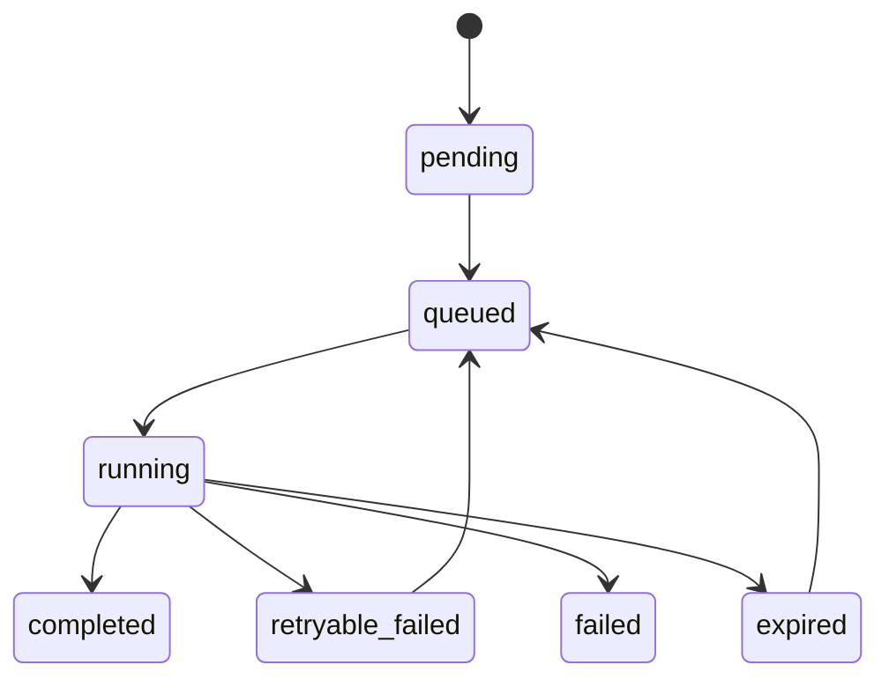

任务表至少包含 task id、owner user id、billing account id、status、progress、message、payload、attempt、lease until、next attempt at、result reference、error、created at 和 updated at。

Worker 可选三种模型：

| 模型 | 适用 |
|---|---|
| 常驻 worker | VM、Docker、Kubernetes、容器型 serverless |
| 队列触发 worker | 云队列、托管任务平台 |
| 一次性 function | 函数型 serverless、单 task 执行 |

必须具备任务租约、超时回收、幂等写入、retryable / terminal 错误分类、repair job、用户查询时的懒触发，以及贯穿日志、账单、模型调用和文件产物的 task id。

---

## 9. 微服务接入方案

标准接入流程：

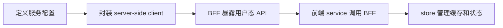

服务配置需要包含：

```text
SERVICE_API_URL
SERVICE_TOKEN
SERVICE_HEALTH_PATH
SERVICE_REQUEST_TIMEOUT
SERVICE_LONG_TASK_TIMEOUT
SERVICE_TLS_POLICY
```

文档和示例只能使用占位符，不能写真实 URL 和真实 token。

每个下游 client 应统一封装 base URL、服务凭证、用户身份头、billing key / account、超时、重试策略、JSON 解析、错误解析、healthcheck、请求 ID 和日志脱敏。

下游不可用时，BFF 应能返回未配置、healthcheck failed、upstream timeout、upstream unavailable、quota exceeded、permission denied 等稳定状态。

微服务接入时还要明确下游服务自己的基础设施依赖。不要只检查 BFF 的数据库和 Redis；如果 BFF 调用下游失败，真正故障可能是下游 API 进程、下游 Postgres、下游 Redis、worker、队列或模型网关。

建议每个下游服务维护一张最小依赖矩阵：

| 依赖 | 用途 | 本地 dev | dev/staging/prod | 失败表现 |
|---|---|---|---|---|
| Service API | 领域服务 HTTP 入口 | 本地地址或容器端口 | 受控服务地址或网关 | upstream unavailable / timeout |
| Service DB | 任务和领域状态 | 本地容器或临时库 | 独立托管库 | API readiness failed |
| Service Redis / Queue | worker 队列、租约、短期状态 | 本地容器 | 独立托管 Redis/Queue | 任务不推进或 worker unhealthy |
| Model / Billing Gateway | 成本能力 | dev endpoint | staging / production endpoint | quota / billing / provider error |

排障顺序应从物理链路开始：

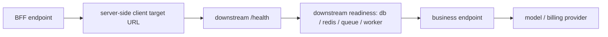

---

## 10. 部署方案

### 10.1 环境矩阵

| 环境 | 目标 | 数据 | 外部依赖 | 密钥 | 发布方式 |
|---|---|---|---|---|---|
| local | 快速开发和本地验证 | 本地或临时库 | mock、dev endpoint、本地容器 | 本地占位符，不用生产值 | 手动启动 |
| dev | 多人联调 | 独立 dev 数据 | dev / staging 下游 | 平台 dev secret | 自动或手动部署 |
| staging | 生产前验证 | 类生产数据或脱敏数据 | 类生产依赖 | staging secret | CI/CD 部署 |
| production | 真实用户与真实成本 | 生产数据 | 生产依赖 | production secret / secret manager | 审批后发布 |

环境治理原则：

- local 可以不完整，但调用路径要与生产一致；
- dev 可以容忍脏数据，但不能使用生产密钥；
- staging 应尽量复现生产拓扑；
- production 只允许受控发布和受控配置变更；
- 不同环境的数据库、Redis、对象存储、计费网关和模型网关必须明确隔离。

### 10.2 本地开发

```text
Web / BFF
  本机 dev server

基础设施
  Docker Compose: Postgres + Redis + S3-compatible storage

外部服务
  本地 mock / dev endpoint / staging endpoint
```

本地目标不是复制生产所有云资源，而是保证数据库可迁移、Redis 可用、文件存储可用、env 校验一致、服务间调用路径一致，并且不使用生产密钥。

### 10.2.1 混合本地开发拓扑

本地开发不必在“所有依赖都本地”和“所有依赖都远程”之间二选一。可以让待调试服务及其必要依赖本地运行，其余依赖使用隔离的开发环境。

治理原则：

- 每个服务写清自己的配置来源和连接角色；
- 每个服务提供独立 `health` / `ready`，暴露数据库、缓存、队列与 worker 的就绪状态；
- BFF 错误应区分上游不可达、依赖未就绪、业务拒绝、超时与内部错误；
- 文档中禁止写真实连接串，只写连接角色和占位符。

可复述版本：本地联调的关键不是“全部本地化”，而是每个服务的依赖边界可解释、可验证、可重启。

### 10.3 生产自部署

适合早期私有化或小团队：

```text
app
postgres
redis
object storage
optional search
optional observability
```

要求所有服务 healthcheck、app 等依赖 ready 后启动、env 从外部注入、数据卷和对象存储明确备份、migration 独立执行、镜像版本可回滚。

### 10.4 托管云部署

推荐中小 SaaS 优先使用托管服务：

| 能力 | 托管形态 |
|---|---|
| Web | Vercel、Cloudflare、Fly、Render、云函数、容器服务 |
| DB | 托管 Postgres |
| Redis | 托管 Redis |
| 文件 | S3 / R2 / OSS / TOS |
| 队列 | QStash、云队列、任务平台 |
| 观测 | Sentry、Grafana Cloud、OTEL、Langfuse |

原则：先用托管服务降低运维负担；业务代码通过抽象层访问云资源；避免把某云厂商 SDK 散落在业务逻辑中；成本增长后再考虑自建或迁移。

### 10.5 API Gateway 与私有网络

生产环境通常需要 API Gateway、HTTPS、CORS、WAF、VPC、Security Group、函数或容器并发上限、请求超时、冷启动评估，以及内部服务只允许 BFF 调用。

---

## 11. 环境变量与密钥治理

推荐按域组织 env：

```text
APP
AUTH
DATABASE
REDIS
FILE
BILLING
MODEL
QUEUE
GATEWAY
OBSERVABILITY
EXTERNAL_SERVICE
```

每个 env 都要说明用途、是否必填、默认值、本地示例、是否服务端专用、是否可暴露给浏览器、生产如何注入。

不能写进仓库和文档正文的内容：真实数据库连接串、Redis 密码、对象存储 access key、auth secret、key vault secret、私钥、JWT、service token、provider API key、cookie、session、私有 URL、部署账号信息。

示例只能写：

```text
DATABASE_URL=postgresql://<user>:<password>@<host>:5432/<db>
REDIS_URL=redis://<user>:<password>@<host>:6379/<db>
SERVICE_TOKEN=<long-random-token>
```

MVP 可以用平台 env。可运营版本应迁移到 CI secret、cloud secret manager、KMS、权限分级、定期轮换和变更审计。

用户填入的模型 key 必须加密落库（推荐带认证标签的对称加密，主密钥与数据库分离、按用户隔离），只在服务端**按请求**解密并注入下游请求头，绝不下发浏览器、不进日志。

---

## 12. 可观测性与运维

最小能力：

| 能力 | 作用 |
|---|---|
| health | 判断服务进程是否存活 |
| readiness | 判断依赖是否可用 |
| structured logs | 定位请求、任务、用户、下游服务 |
| metrics | 错误率、耗时、队列深度、成本 |
| trace | 串联 BFF、微服务、模型网关 |
| audit log | 记录管理员和敏感操作 |
| alert | 依赖失败、错误率上升、成本异常 |

推荐日志字段：

```text
request_id
trace_id
user_id
task_id
billing_account_id
service
operation
downstream
status
duration_ms
retry_attempt
model_provider
model_name
cost_source
```

不要记录完整 token、完整 key、私有 URL、prompt 原文、用户上传原文、Authorization header 或 cookie。

部署前检查 env、secret 来源、migration、DB、Redis、对象存储、billing gateway、model gateway、service token、healthcheck 和回滚版本。

部署后检查登录、关键页面、API、文件上传和预览、模型请求、余额查询、长任务提交与完成、队列深度、错误率。

### 12.1 依赖分级

生产系统里的依赖不应该一视同仁。每个依赖都要分级，决定告警、降级和恢复策略。

| 等级 | 含义 | 示例 | 策略 |
|---|---|---|---|
| P0 | 核心链路不可用会导致产品整体不可用 | 主数据库、身份服务、BFF | 强告警、快速回滚、优先恢复 |
| P1 | 核心功能不可用，但站点仍可访问 | 模型网关、计费网关、对象存储 | 降级提示、暂停相关功能 |
| P2 | 辅助功能不可用 | 搜索、分析、推荐、通知 | 弱提示、后台重试 |
| P3 | 非实时能力 | 报表、离线统计、归档任务 | 延迟处理、批量补偿 |

### 12.2 容量与成本指标

真实运营项目需要持续观察容量和成本，而不是只看接口是否 200。

关键指标：

- API p50 / p95 / p99 latency；
- error rate；
- active users；
- request per minute；
- DB connection usage；
- slow queries；
- Redis memory and hit rate；
- queue depth；
- task success rate；
- task retry rate；
- object storage size；
- model tokens / requests；
- model cost per user；
- cost per successful task；
- billing reservation pending count。

### 12.3 备份与恢复

备份不是“有备份文件”就结束，必须能恢复。

最低要求：

- Postgres 定时备份；
- 对象存储生命周期策略；
- 关键配置和 secret 有恢复路径；
- staging 定期做恢复演练；
- 删除用户数据时区分业务记录、文件对象和审计记录；
- 重要任务结果可通过 `task_id` 找回或重新生成。

---

## 13. 运营后台与人工干预

真实运营项目不能只依赖用户界面。很多生产问题需要管理员、运维或开发通过受控入口处理。

### 13.1 管理能力

至少需要预留这些管理能力：

- 查询任务状态分布；
- 查看最近失败样本；
- 查看队列深度；
- 查看 worker / function 健康状态；
- 导出某个用户或资源的完整诊断包；
- 修复超时或可重试任务；
- 触发数据归档清理；
- 查看计费账户余额、预扣款、消费流水；
- 对账、冲正、补单；
- 查询审计日志。

这些能力不一定都要做成后台 UI。早期可以是受控 CLI 或管理 API，但必须有：

- 强鉴权；
- 操作审计；
- dry-run；
- 最小权限；
- 不返回敏感原文和密钥；
- 可回滚或可补偿。

### 13.2 人工干预原则

人工干预不是破坏自动化，而是生产系统的一部分。设计时要明确：

- 哪些问题允许自动修复；
- 哪些问题需要人工确认；
- 哪些操作只能只读；
- 哪些操作必须先 dry-run；
- 哪些操作会影响账务或用户数据；
- 谁能执行；
- 执行后如何留痕。

---

## 14. 数据生命周期与隐私

真实项目里的数据不是“永远放着”。上传文件、任务结果、模型调用、业务事件、删除归档都应有生命周期。

### 14.1 数据分类

| 数据类型 | 示例 | 存储建议 | 生命周期 |
|---|---|---|---|
| 活跃业务数据 | 用户资源、项目、任务、报告 | Postgres | 用户删除或业务归档前保留 |
| 观测事件 | 上传、分析、查看、删除、模型调用元数据 | Postgres / event table | 按运营和排障需要保留 |
| 大文件产物 | 上传原文、导出包、删除归档、任务产物 | 对象存储 | 按 retention 策略清理 |
| 运行日志 | API / worker 日志 | 日志后端 | 按运维策略保留 |
| 审计日志 | 管理员操作、账务调整、敏感操作 | Postgres / audit store | 保留周期更长 |

### 14.2 删除不是简单 delete

对重要业务对象，推荐 archive-first：

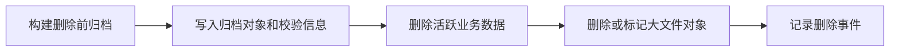

这样可以避免“用户删除后无法复盘事故、无法分析产品问题、无法对账”的危险状态。

### 14.3 事件只存元数据

观测事件和业务事件不应存完整原文。

允许：

- 状态；
- 阶段；
- 数量；
- 耗时；
- 重试次数；
- 错误类别；
- provider / model；
- token 数；
- 估算成本；
- artifact id；
- hash；
- storage key。

不允许：

- 完整用户上传文本；
- 完整 prompt；
- 完整模型响应；
- API key；
- service token；
- cookie；
- Authorization header；
- 密码；
- 私有 URL。

---

## 15. 错误契约与事故响应

### 15.1 稳定错误码

前端和后端不能依赖错误文案匹配。生产 API 应区分：

```mermaid
flowchart TB
  status["HTTP status<br/>表达传输层语义"] --> code["error code<br/>表达稳定业务语义"]
  code --> msg["message<br/>面向用户展示，可调整、可本地化"]
```

新增错误码时，应同步：

- API 文档；
- 前端错误映射；
- 后端测试；
- 用户提示；
- 监控分类。

### 15.2 事故响应闭环

事故处理不只是看日志。一个成熟系统需要能回答：

- 哪个用户触发；
- 哪个请求触发；
- 哪个任务触发；
- 哪个阶段失败；
- 是否重试；
- 是否扣费；
- 是否写入了部分数据；
- 是否有可恢复入口；
- 是否影响其他用户；
- 是否需要回滚；
- 是否需要补偿。

推荐事故处理流程：

```mermaid
flowchart LR
  alert[发现告警] --> scope[判断影响范围]
  scope --> locate["定位 request_id / task_id / user_id"]
  locate --> deps[查看依赖状态和最近失败样本]
  deps --> decide[决定降级、重试、修复或回滚]
  decide --> root[记录根因和补偿动作]
  root --> prevent[增加防复发检查]
```

### 15.3 自动重试边界

不是所有失败都应该重试。

| 错误类型 | 策略 |
|---|---|
| 网络抖动、超时、限流、临时连接失败 | 指数退避重试 |
| 输入为空、格式不支持、权限不足、额度不足 | 终态失败 |
| 下游部分成功、任务状态不确定 | 进入待修复状态 |
| 已经产生费用但业务失败 | 进入对账或补偿流程 |

重试前提是幂等。异步任务要默认按 at-least-once 执行模型设计，不能假设只会跑一次。

---

## 16. 自研、复用与采购取舍

真实项目的一个重要经验是：不是所有能力都应该自研。

### 16.1 取舍原则

| 能力类型 | 推荐策略 | 原因 |
|---|---|---|
| 通用基础设施 | 优先托管或成熟开源 | 避免把时间消耗在低差异化运维上 |
| 身份、数据库、对象存储、队列 | 优先成熟组件 | 稳定性和安全性比自研更重要 |
| 模型网关、计费网关 | 可复用成熟底座，再按业务扩展 | 多 provider 和成本治理复杂 |
| 核心领域逻辑 | 自研 | 这是产品差异化来源 |
| 厂商强相关能力 | 通过网关封装 | 降低供应商绑定对业务层的污染 |
| 管理后台和运维工具 | 先做最小可用 | 早期 CLI / 管理 API 比完整 UI 更划算 |

### 16.2 判断一个能力是否该拆服务

适合拆服务：

- 生命周期不同；
- 扩缩容特征不同；
- 依赖不同；
- 故障隔离要求高；
- 数据边界清晰；
- 可由独立团队维护；
- 可通过稳定 API 对外提供能力。

不适合拆服务：

- 只是为了“看起来微服务”；
- 数据必须频繁跨库 join；
- API 契约尚未稳定；
- 团队没有运维能力；
- 拆完只增加部署和排障成本。

---

## 17. CI/CD 与发布

MVP：

```mermaid
flowchart LR
  pr[push / PR] --> lint[lint]
  lint --> tc[typecheck]
  tc --> ut[unit test]
  ut --> build[build]
  build --> deploy[manual deploy]
```

可运营版本：

```mermaid
flowchart LR
  pr[PR] --> test[test]
  test --> img[build image]
  img --> staging[deploy staging]
  staging --> smoke[smoke test]
  smoke --> approve[manual approval]
  approve --> prod[deploy production]
  prod --> hc[healthcheck]
```

可扩展版本：

```mermaid
flowchart LR
  rel[release] --> canary[canary]
  canary --> gate[metrics gate]
  gate --> roll[gradual rollout]
  roll --> rollback[auto rollback]
```

发布必须保证每个版本可追踪、每次变更可回滚、migration 有顺序、secret 不进入日志、生产部署不依赖个人本机状态。

---

## 18. 未来项目落地路线

### 18.1 第一阶段：能上线

目标：小规模真实用户能用。

必做：Web + BFF、登录、Postgres、基础用户数据隔离、对象存储、模型网关、简单 usage 记录、`.env.example`、healthcheck、Dockerfile 或平台 build 配置、structured logs。

暂不做：复杂组织权限、完整计费系统、多云部署、K8s、自建观测平台、分库分表。

### 18.2 第二阶段：能运营

目标：能收费、能排障、能处理长任务。

新增 billing account、usage event、reservation、admin dashboard、Redis rate limit、task table、worker / function、ready check、metrics、CI staging、secret manager、backup / restore、基础告警。

### 18.3 第三阶段：能扩展

目标：团队协作、权限治理、稳定发布。

新增 organization、workspace、role / permission、team billing account、audit log、feature flag、canary deploy、distributed tracing、key rotation、data retention、provider failover、private networking。

判断标准：

```text
当问题已经影响真实运营、成本、权限、稳定性或迭代速度，再升级基础设施。
```

---

## 19. 可复用检查表

### 19.1 新项目初始化

- 是否只有一个身份权威源；
- 是否所有业务表都有 owner；
- 是否所有前端请求都经过 BFF；
- 是否没有浏览器可见服务端密钥；
- 是否有 `.env.example`；
- 是否有 Postgres migration；
- 是否文件进入对象存储；
- 是否有 healthcheck；
- 是否有 structured logs。

### 19.2 接入一个外部服务

- 是否定义服务端 env；
- 是否有 server-side client；
- 是否有超时；
- 是否有错误映射；
- 是否有 healthcheck；
- 是否有 readiness，并能暴露下游 DB / Redis / Queue / Worker 状态；
- 是否明确用户身份如何传递；
- 是否明确下游服务是否拥有自己的数据库和 Redis；
- 是否明确 BFF 数据库与下游服务数据库不是同一套；
- 是否明确本地 dev、dev、staging、production 的连接目标；
- 是否明确是否产生费用；
- 是否记录 request id；
- 是否避免泄漏下游原始错误。

### 19.3 接入一个长任务

- 是否有 task id；
- 是否有任务表；
- 是否有状态机；
- 是否有进度；
- 是否有重试；
- 是否有租约或幂等；
- 是否有结果引用；
- 是否有 repair；
- 是否有成本归属；
- 是否能从日志追踪。

### 19.4 接入一个模型能力

- 是否经过 Billing Gateway；
- 是否有 billing account；
- 是否有预扣款或额度检查；
- 是否有 usage event；
- 是否有 provider / model 记录；
- 是否有预算不足错误；
- 是否避免双账本；
- 是否禁止服务绕过计费入口。

### 19.5 生产运营检查

- 是否有管理端只读诊断入口；
- 是否有任务 repair 或补偿入口；
- 是否有 archive-first 删除策略；
- 是否有稳定错误码；
- 是否能按 request id / task id / user id 定位事故；
- 是否能从 BFF 的上游调用失败继续定位到下游 API / DB / Redis / Worker；
- 是否能区分可重试错误和终态错误；
- 是否有账务对账和冲正路径；
- 是否有备份恢复演练；
- 是否明确哪些能力自研、哪些复用、哪些采购。

---

## 20. 可复述的系统设计素材

这些问题是从真实运营项目中抽象出来的高价值素材，适合后续复盘、面试或设计自己项目时反复检查。

| 问题 | 应回答的核心点 |
|---|---|
| 如何设计一个 AI SaaS 的 BFF？ | 身份收口、服务端密钥、下游代理、错误映射、计费上下文 |
| 长任务为什么不能放在 HTTP 请求里？ | 超时、重试、进度、恢复、任务状态持久化 |
| 如何让异步任务可恢复？ | task 表、租约、幂等、错误分类、repair、关联 ID |
| 如何做多用户数据隔离？ | 统一身份源、owner 字段、数据访问层过滤、后续扩组织 |
| 如何设计模型调用计费？ | Billing Gateway、预扣款、usage event、消费归属、双账本风险 |
| 如何避免服务间身份伪造？ | service token、可信用户头、BFF 注入、私有网络、短期 JWT |
| 文件为什么不能放本地盘？ | 多副本、serverless、迁移、恢复、对象存储 |
| 生产系统怎么排障？ | request id、task id、user id、阶段、重试、费用、失败样本 |
| 为什么不一开始就上 K8s / 分库分表？ | 规模、复杂度、运维成本、真实瓶颈 |
| 自研和复用怎么取舍？ | 通用能力复用，领域核心自研，厂商能力网关封装 |

---

## 21. 待补充

以下主题需要在未来结合更多真实运维材料补充：

- 生产级密钥轮换流程；
- 计费对账任务；
- 完整告警策略；
- 数据备份和恢复演练；
- 组织级权限模型；
- API Gateway 限流和 WAF 策略；
- 灾备等级；
- 成本监控和预算预警。
