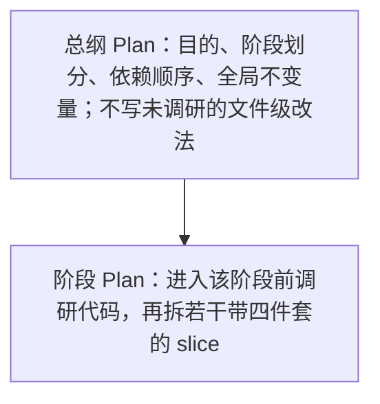

# 可执行计划治理

本文约束 **Plan-Build**：如何生成可执行 Plan，以及如何按 Plan 落地。目标读者是无会话记忆的 Agent 与审阅 Plan 的人。

方案回答「做什么、为什么、边界」；Plan 回答「按什么顺序、改哪些文件、如何验证、怎样算完成」。把方案原文搬进 Plan，或把 Plan 写成无验收口径的设计说明，都会提高返工率。

## 本文用途

Agent 无跨会话记忆。每次生成 Plan 时，应先读本文，再读目标方案 / 需求与相关代码，产出满足下文标准的 Plan。本文是生成约束，不是某次任务的施工单。

## Plan 是什么 / 不是什么

| 是 | 不是 |
|---|---|
| 可独立执行的施工单 | 方案 spec 的复制粘贴 |
| 带文件路径、命令、验收口径的工作包 | 只有阶段名的路线图 |
| 无聊天记忆也能继续推进 | 依赖「你懂的」的备忘录 |
| 执行中可修订的活文档 | 写完不再更新的 PRD |

## 何时需要 Plan

满足任一条件，先写 Plan 再写代码：

- 跨多个模块、服务或仓库，存在契约依赖。
- 重构或替换现有行为，有回归风险。
- 需要先调研代码才能确定改法。
- 体量超过一个 fresh session 能稳定完成。
- 存在未决架构选择，选错会大面积返工。
- 需要人工在写码前 approve。

通常不需要 Plan：

- 单文件、行为明确的局部修复。
- 纯文档 / 注释 / 示例，且不改变运行时契约。
- 已有 Plan 内某个 slice 的具体实现（属于执行，不是新 Plan）。

与 Cursor 官方一致：复杂、多文件、需求不清、要先定架构 → Plan Mode；小改或做过多次的任务 → 直接 Agent。

## 好 Plan 的六条标准

一个好 Plan 能让**没有聊天记忆的执行者**仅凭 Plan（及其中引用的路径）完成可验证结果。

1. **可观察验收**  
   验收写成行为与命令结果，不写成内部实现口号。  
   好：「`pytest path/to/test.py -q` 全绿；字段 X 存在时 UI 渲染新曲线，缺失时回退旧曲线。」  
   坏：「完成双账本模块」「新增某某结构体」。

2. **执行自包含**  
   Plan 内嵌执行所需的约束、术语、接线事实（文件、接口名、字段名、工作目录）。不假设读者读过聊天记录。  
   自包含指**执行事实**，不是把方案论证全文粘贴进来。方案级「为什么」留在 spec；Plan 只抽取本次最小闭环，并补上调研后才知道的代码事实。

3. **验证先于编码**  
   每个可执行单元在写码前写明 `Verify`。没有 `Verify` 的单元不算可执行。

4. **粒度可装下**  
   一个执行单元应能在一个 fresh context 内完成调研后的实现与验证。关注点说不清、或核心改动文件明显过多时拆分。文件数是启发式，不是硬配额。

5. **可逆推进**  
   优先加法式步骤，可重复执行，可局部回滚。替换型任务：新旧并存 → 验证 → 再删旧路径。

6. **范围显式**  
   写明本次做 / 不做。发现必须改 Plan 外文件时，先修订 Plan，再改代码。

## Plan 与方案的边界

| | 方案（Spec / ADR） | 可执行 Plan |
|---|---|---|
| 目的 | 问题、模型、原则、长期约束 | 本次落地步骤与验收 |
| 读者 | 产品 / 架构 / 评审 | 执行者 |
| 内容 | 数据模型、规则、决策门 | 路径、命令、slice、Verify |
| 失败时 | 回到方案是否可行 | 调 slice、补验证、回滚 |

**方案不执行；Plan 不重复论证。**

## 生成 Plan 的流程

每次生成 Plan，按此顺序：

1. **读约束**：本文 + 目标方案 / 需求中与本次相关的章节（不要整份方案当 Plan）。
2. **调研代码**：定位真实文件、现有契约、测试入口、降级路径；禁止在未打开相关代码时写死文件级步骤。
3. **澄清歧义**：有多种合法做法或边界不清时，先问清再写 Plan（Cursor Plan Mode 的 clarifying questions）。
4. **写出 Plan**：按下方骨架；默认单层。仅当单份 Plan 无法在一个可审阅篇幅内说清全部阶段时，再拆总纲 + 阶段 Plan。
5. **人工审阅**：对照「审阅清单」；通过后再 Build。

### Plan 最小骨架

生成的 Plan 至少包含：

```text
目的：完成后用户 / 系统可观察的变化（1–3 句）
范围：本次做 / 本次不做
写入仓库：明确 git 根；多仓则分列
前置事实：调研得到的关键路径、接口名、字段名（短列表）
工作单元：阶段或 slice 列表（见下）
风险与回退：主要风险；失败时如何降级或回滚
```

每个工作单元（阶段或 slice）必须有四件套：

| 字段 | 含义 |
|---|---|
| `Files` | 显式路径，禁止「等相关文件」 |
| `Changes` | 动词 + 单关注点目标 |
| `Verify` | 命令、工作目录、预期结果；或明确的人工检查步骤 |
| `Done-when` | 可客观判断的完成条件 |

### 单层 vs 双层

**默认单层**：一份 Plan 覆盖一个可交付增量（做完后系统可运行、可验证）。

**升级为双层**（仅当需要）：



总纲的 todo 是阶段，不是 bug 列表。下一阶段 Plan 必须携带上一阶段实测接线事实（真实路径、字段名），不能只从抽象总纲展开。

### 何时拆成多份 Plan

- 下一阶段依赖上一阶段实测事实。
- 写入多个 git 仓库，提交纪律不宜混在一份里。
- 风险域不同（例如核心算法 vs 依赖外部系统的旁路），一条失败不应拖死全部。
- 需先做可行性 spike，通过后再开实现 Plan。
- 当前 Plan 已无法自包含，需 handoff 后开新 Plan。

停止拆分：再拆会导致无法独立验收，或任务已小于一个 session 且路径明确。

## 执行纪律（Build）

对每个工作单元：

1. **按 Plan 实现**，不扩大 scope。
2. **只跑该单元的 `Verify`**。
3. **失败时**：优先回退改动、修订 Plan 再跑；避免在同一长对话里连续硬修。
4. **提交**：仅在用户明确要求时提交；一单元一原子提交更易回滚。

补充：

- 单元之间可用 fresh session；只喂 Plan + 必要源码。
- 动手前确认相关测试基线（全绿，或记录已知存量失败以免误判）。
- 替换型任务：新链路可降级；删旧路径放在验证通过后的收尾单元。

## 验收口径

按风险选最窄有效验证，不默认跑全量：

| 风险 | 优先验证 |
|---|---|
| 纯函数 / 算法 | 目标单测 + golden |
| API / schema | 契约测试 + 消费方类型检查 |
| 编排 / 状态机 | 集成测试 + 降级路径 |
| UI | 有数据 / 无数据 / 降级三态 |
| LLM 抽取 | schema 契约；真实 badcase 优于空转 mock |

迁移类额外要求：新旧可对比样本；收尾单元写明删除旧字段 / 旧代码的条件，避免只停写不删除的僵尸路径。

## 反模式

| 反模式 | 后果 |
|---|---|
| 把方案全文搬进 Plan | 过长、无验收、仍要重调研 |
| 未调研代码就写死文件级步骤 | 与真实代码不符，必返工 |
| 整份总纲一次丢给 Agent 实现 | 上下文污染、难回滚 |
| 只有阶段名、无四件套 | 无法判断完成 |
| 无 `Verify` | 「感觉做完了」 |
| 单单元多关注点、大混改 | 故障域过大 |
| Plan 里争论方案对错 | 执行者无所适从 |
| 用无关绿灯冒充验证 | 契约改了却只跑了格式检查 |
| 失败后在脏对话里连修 | 不如回退重来 |
| 未验证就删旧路径 | 无兜底 |

## 审阅清单（生成后、Build 前）

- [ ] 仅凭 Plan 能否开工（含路径与命令）？
- [ ] 每个工作单元是否有 `Files / Changes / Verify / Done-when`？
- [ ] 是否写清本次不做？是否砍掉了方案里暂不落地的部分？
- [ ] 是否先调研再写文件级步骤？
- [ ] 单单元是否单关注点、session 可装下？
- [ ] 替换型是否新旧并存，且收尾删除条件明确？
- [ ] 写入仓库与工作目录是否标明？

## 执行后清单

- [ ] `Verify` 是否通过？
- [ ] 新发现的接线事实是否回写 Plan？
- [ ] 无关 dirty 是否未混入？

## 参考（原则来源，非照搬模板）

| 来源 | 采用什么 | 不照搬什么 |
|---|---|---|
| [Cursor Plan Mode](https://cursor.com/docs/agent/plan-mode) / [Agent best practices](https://cursor.com/blog/agent-best-practices) | 先调研、澄清、带路径的 Plan、人工 approve 再 Build；跑偏则回退改 Plan 重跑 | 不要求固定双层 |
| [OpenAI ExecPlans](https://github.com/openai/openai-cookbook/blob/main/articles/codex_exec_plans.md) | 自包含、可观察验收、里程碑可独立验证 | 不强制其全文骨架与「禁止 checklist」文体 |
| [Anthropic: Building effective agents](https://www.anthropic.com/engineering/building-effective-agents) | 简单优先；每步用环境结果作 ground truth | 不引入额外 agent 框架 |
| Strangler / 新旧并存 | 仅用于替换与迁移 | 不作为每个小改的默认结构 |
