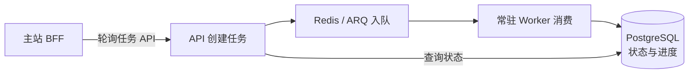
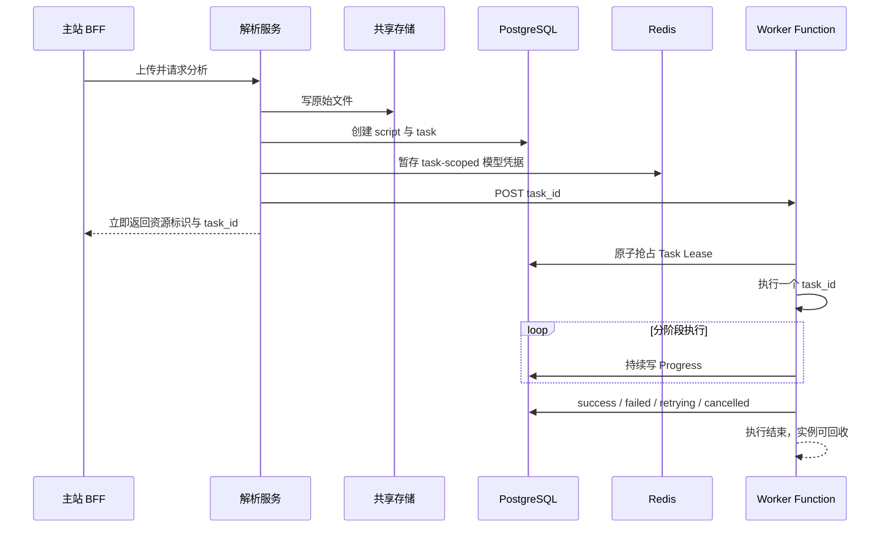

# 踩坑 04：从同步长任务到可恢复 Worker

## 一句话

长文本分析耗时可达数分钟，放在同步 HTTP 或进程内后台执行都会超时、丢状态；我先落地持久化任务和常驻 worker，再根据函数型部署约束改成一次性 worker，并用租约、重试和 repair 保证可恢复。

## 背景

一次长文本分析包含文件读取、结构切分、多个 LLM 链、结果构造和持久化。它不是普通 CRUD：

- 运行时间从几十秒到数分钟；
- 中途需要展示阶段进度；
- 模型网关和网络会暂时失败；
- 用户可能取消、重跑或删除；
- 云函数可能超时、崩溃或被回收。

早期同步请求要求 BFF 一直等待，容易出现浏览器/BFF 超时，但后台是否完成又不清楚。

## 第一版：持久化任务 + ARQ

我先将长任务拆为：

这一步解决了同步等待和进程内状态问题，也形成了 `pending/running/success/failed` 的基本状态机。

## 新问题

生产目标是函数型 Serverless，不保证常驻进程长期监听 Redis。继续使用 ARQ 意味着：

- 必须额外维护常驻 worker；
- 部署模型与平台不匹配；
- 函数实例退出后不能依赖内存和消费者状态；
- 触发失败、函数超时和重复执行需要新的恢复机制。

因此不能只把 ARQ worker 打包进云函数。

## 最终架构

## 关键机制

### Postgres 任务事实源

任务保存：

- `status`；
- `progress`；
- `payload`；
- `attempt/max_attempts`；
- `lease_until`；
- `next_attempt_at`；
- `error/result_ref`。

worker 只有抢到租约才能执行，可防止租约有效期内的并发处理。整体仍按至少一次执行考虑：函数超时、租约过期和重新派发都可能带来重复执行，持久化操作必须保持幂等或有锁保护。

### 可恢复触发

- transient 错误进入 `retrying`；
- 管理端 repair 扫描可恢复任务；
- 用户轮询时可懒触发 stuck task；
- API 触发 worker 失败时保留 pending task，而不是直接丢失；
- 函数超时后租约到期可重新认领。

### 短期敏感信息

用户级模型调用凭据不持久化进 task payload，而是按 task 暂存 Redis，并设置 TTL。任务完成后应清理。

### 双状态

资源可用状态与最近分析状态应分离。分析失败不会把已完成结构化处理的资源覆盖成整体失败。

## 取舍

**收益：**

- API 快速返回；
- 进度和错误可查询；
- worker 可弹性拉起和回收；
- 任务可恢复、可重试；
- 状态不依赖单个进程。

**成本：**

- 需要租约和幂等设计；
- API、worker、数据库和共享存储的部署配置更复杂；
- 函数冷启动和平台超时需要持续校准；
- repair 机制本身也需要监控。

## 前端联调

主站 BFF 不再等待完整结果，而是：

- 上传后绑定资源标识；
- 通过最新 `task_id` 查询状态；
- 展示阶段进度、重试和失败；
- success 后继续等待报告持久化；
- 对 failed 任务提供重新分段或重分析。

前端曾因 SWR interval 重建出现“假死”，说明后端状态机正确还不够，消费端也必须按真实状态持续轮询。

## 验证

- 本地用 API 容器和函数型 worker 容器模拟两端；
- 上传后确认 API 立即返回 task；
- 检查只有一个 worker 能 claim；
- 检查进度从 Postgres 更新；
- 模拟 trigger 失败、过期 lease 和 transient 错误；
- 校验 repair/lazy trigger；
- 通过 `/health/ready` 和 metrics 检查 dispatch mode。

## 结果与局限

**已确认：**

- 生产目标可采用函数型 worker；
- Postgres 是任务状态真相源；
- 常驻队列 worker 可保留为开发兼容，不是现行生产目标；
- 主站 BFF 已消费 task 轮询。

**待运行或团队确认：**

- 真实云函数环境的并发、冷启动和超时数据；
- repair 的生产调度频率和告警；
- 任务表长期增长后的归档策略；
- 当前线上实际部署是否完全与仓库默认一致。

## 业务影响

长任务不可靠会直接阻断“上传内容 → 查看结果”的第一条用户路径，还会造成重复提交和重复模型费用。持久化任务的价值不是技术炫技，而是让一次昂贵分析可以被观察、恢复和解释。

## 证据

来自实习中的真实故障与对照实验（细节已脱敏）。

## 面试追问

**为什么不用消息队列？**  
ARQ 对常驻 worker 很合适，但目标平台是一次性函数；Postgres task 既是状态源，也是租约和恢复协调点，避免再维护不匹配的常驻消费者。

**Postgres 能代替所有队列吗？**  
不能。这里任务规模和吞吐有限，核心诉求是状态与恢复。高吞吐、复杂路由场景应重新评估专用队列。

**怎么防重复执行？**  
原子 claim + lease 防租约期内并发；整体不是 exactly-once，业务持久化仍需 advisory lock 或幂等写入。

**worker 触发失败怎么办？**  
task 已先写 Postgres，保持可恢复状态，再由 repair 或轮询懒触发重新派发。
